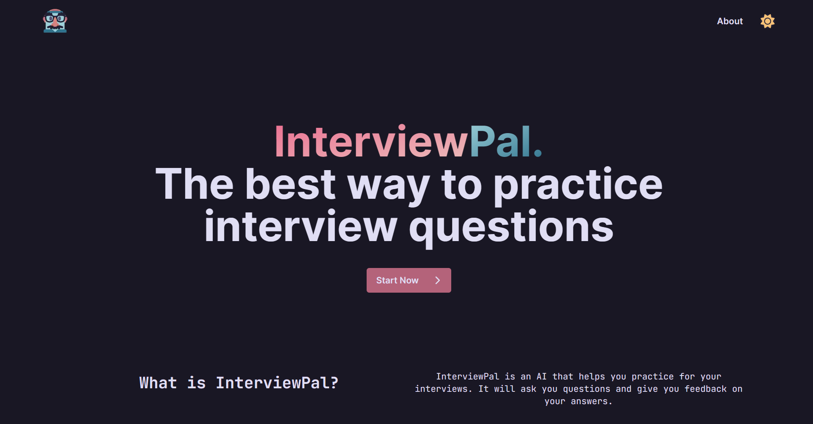

<!-- Improved compatibility of back to top link: See: https://github.com/othneildrew/Best-README-Template/pull/73 -->
<a name="readme-top"></a>
<!--
*** Thanks for checking out the Best-README-Template. If you have a suggestion
*** that would make this better, please fork the repo and create a pull request
*** or simply open an issue with the tag "enhancement".
*** Don't forget to give the project a star!
*** Thanks again! Now go create something AMAZING! :D
-->


<!-- PROJECT SHIELDS -->
<!--
*** I'm using markdown "reference style" links for readability.
*** Reference links are enclosed in brackets [ ] instead of parentheses ( ).
*** See the bottom of this document for the declaration of the reference variables
*** for contributors-url, forks-url, etc. This is an optional, concise syntax you may use.
*** https://www.markdownguide.org/basic-syntax/#reference-style-links
-->


<!-- PROJECT LOGO -->
<br />
<div align="center">
  <a href="https://interviewpal.vercel.app/">
    
  </a>
<h1 align="center">InterviewPal</h3>
  <p align="center">
    InterviewPal is a GPT-3.5 powered AI that helps you practice for your interviews. It will ask you common and relevant interview questions and give you insightful feedback on your answers.
    <br />
    <br />
    <a href="https://youtu.be/6CdYp6nNhCk">View Demo</a>
    ·
    <a href="https://github.com/InterviewPal/InterviewPal/issues">Report Bug</a>
    ·
    <a href="https://github.com/InterviewPal/InterviewPal/issues">Request Feature</a>
</div>
  <a href="https://hackthebreak2023.com/">For Hack The Break</a>


<!-- TABLE OF CONTENTS -->
## Table of Contents
  <ol>
    <li>
      <a href="#about-the-project">About The Project</a>
      <ul>
        <li><a href="#built-with">Built With</a></li>
      </ul>
    </li>
    <li>
      <a href="#getting-started">Getting Started</a>
      <ul>
        <li><a href="#prerequisites">Prerequisites</a></li>
        <li><a href="#installation">Installation</a></li>
      </ul>
    </li>
    <li><a href="#license">License</a></li>
    <li><a href="#acknowledgments">Acknowledgments</a></li>
  </ol>


</br>

<!-- ABOUT THE PROJECT -->
## About The Project

  <a href="https://interviewpal.vercel.app/">
    
  </a>


<p align="right">(<a href="#readme-top">back to top</a>)</p>


## Built With

 [![Next][Next.js]][Next-url] 
 [![React][React.js]][React-url] \
 [![Tailwind][Tailwind.css]][Tailwind-url]
 [![Vercel][Vercel]][Vercel-url] \
  [![Redis][Redis]][Redis-url]
 [![RosePine][RosePine]][RosePine-url]
 [![GPT-3.5][GPT-3.5]][GPT-3.5-url] 

<p align="right">(<a href="#readme-top">back to top</a>)</p>


<!-- GETTING STARTED -->
## Getting Started

This is a [Next.js](https://nextjs.org/) project bootstrapped with [`create-next-app`](https://github.com/vercel/next.js/tree/canary/packages/create-next-app).

First, run the development server:

```bash
npm run dev
# or
yarn dev
# or
pnpm dev
```

Open [http://localhost:3000](http://localhost:3000) with your browser to see the result.

You can start editing the page by modifying `pages/index.tsx`. The page auto-updates as you edit the file.

[API routes](https://nextjs.org/docs/api-routes/introduction) can be accessed on [http://localhost:3000/api/hello](http://localhost:3000/api/hello). This endpoint can be edited in `pages/api/hello.ts`.

The `pages/api` directory is mapped to `/api/*`. Files in this directory are treated as [API routes](https://nextjs.org/docs/api-routes/introduction) instead of React pages.

Remember to create a `.env.local` file in the root of the project and add the following environment variables:

```
OPENAI_API_KEY="insert-your-key-here"
REDIS_URL="insert-your-url-here"
```

### Learn More

To learn more about Next.js, take a look at the following resources:

- [Next.js Documentation](https://nextjs.org/docs) - learn about Next.js features and API.
- [Learn Next.js](https://nextjs.org/learn) - an interactive Next.js tutorial.

You can check out [the Next.js GitHub repository](https://github.com/vercel/next.js/) - your feedback and contributions are welcome!

### Deploy on Vercel

The easiest way to deploy your Next.js app is to use the [Vercel Platform](https://vercel.com/new?utm_medium=default-template&filter=next.js&utm_source=create-next-app&utm_campaign=create-next-app-readme) from the creators of Next.js.

Check out our [Next.js deployment documentation](https://nextjs.org/docs/deployment) for more details.

</br>
<!-- ACKNOWLEDGMENTS -->

## Our Team

* [Jessie Zhong](https://github.com/token03)
* [Sean Ng](https://github.com/23o4i7)
* [Ian Chao](https://github.com/iantelli)
* [Ilia Abedianamiri](https://github.com/iliaamiri)
* [Kiefer Hogg](https://github.com/Kieferhogg)

<p align="right">(<a href="#readme-top">back to top</a>)</p>

<!-- LICENSE -->
## License

Distributed under the MIT License. See `LICENSE` for more information.

<p align="right">(<a href="#readme-top">back to top</a>)</p>


<!-- MARKDOWN LINKS & IMAGES -->
<!-- https://www.markdownguide.org/basic-syntax/#reference-style-links -->
[Next.js]: https://img.shields.io/badge/next.js-000000?style=for-the-badge&logo=nextdotjs&logoColor=white
[Next-url]: https://nextjs.org/
[React.js]: https://img.shields.io/badge/React-20232A?style=for-the-badge&logo=react&logoColor=61DAFB
[React-url]: https://reactjs.org/
[Tailwind.css]: https://img.shields.io/badge/Tailwind_CSS-38B2AC?style=for-the-badge&logo=tailwind-css&logoColor=white
[Tailwind-url]: https://tailwindcss.com/
[Vercel]: https://img.shields.io/badge/Vercel-000000?style=for-the-badge&logo=vercel&logoColor=white
[Vercel-url]: https://vercel.com/
[RosePine]: https://img.shields.io/badge/RosePine-26233a?style=for-the-badge&logo=rosepine&logoColor=purple
[RosePine-url]: https://rosepine.com/
[GPT-3.5]: https://img.shields.io/badge/GPT--3-31748f?style=for-the-badge&logo=gpt3&logoColor=white
[GPT-3.5-url]: https://openai.com/blog/openai-api/
[Redis]: https://img.shields.io/badge/redis-%23DD0031.svg?&style=for-the-badge&logo=redis&logoColor=white
[Redis-url]: https://redis.io/